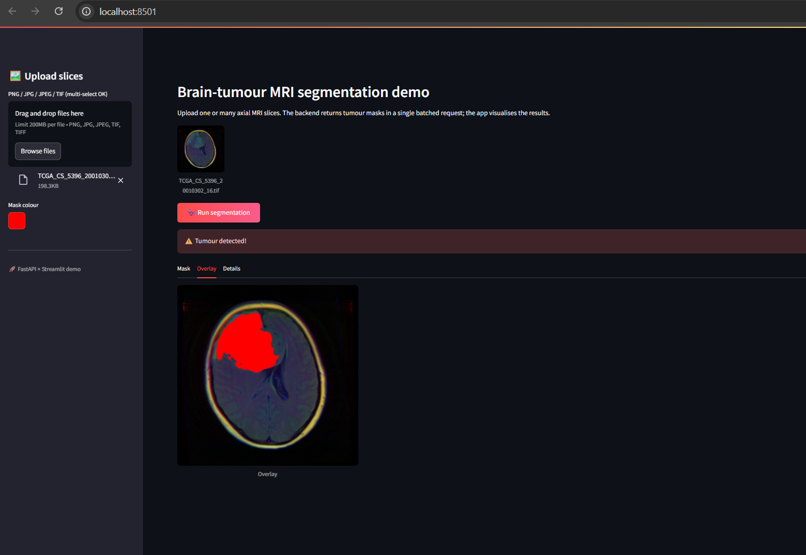
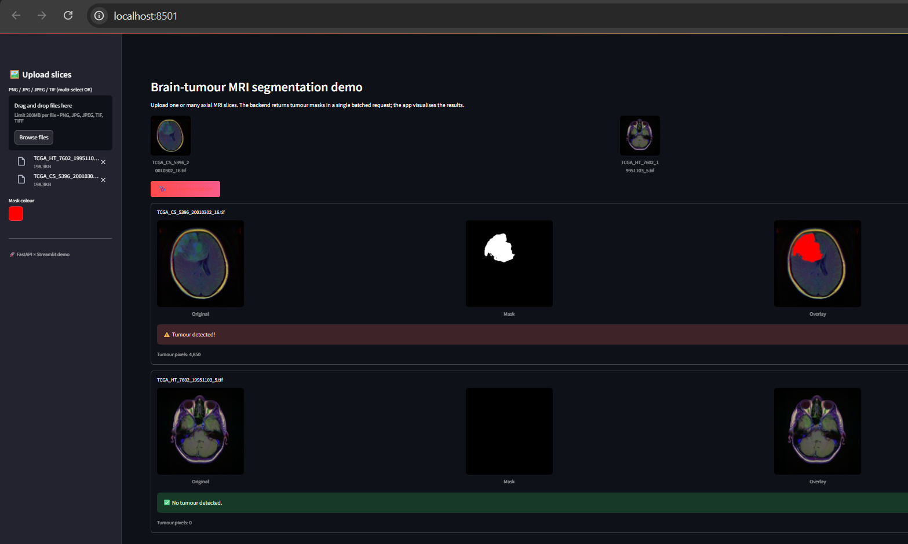
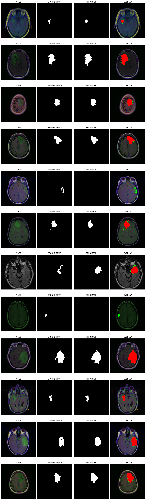

# Sushant Bodade & Tejas Billava

# Brain-Tumour MRI Segmentation – UNet

A UNet-based pipeline that segments brain-tumour regions in
MRI Scans and serves the results through a FastAPI endpoint with a Streamlit front-end.

Magnetic-resonance imaging (MRI) is the modality of choice for visualising soft tissue.
Automatic tissue classification is indispensable for:

- early detection of pathologies such as gliomas or multiple-sclerosis lesions
- objective follow-up of tumour growth or shrinkage during therapy
- volumetric quantification of structures (GM, WM, thalamus, hippocampus, …)
- 3-D visualisation for surgical planning

---

## Problem Formulation

Given a single axial MRI slice **I ∈ ℝH×W×3**, predict a binary mask  
**M ∈ {0,1}H×W** where

- **Mi,j = 1** if pixel _(i,j)_ belongs to tumour tissue
- **Mi,j = 0** otherwise

---

## Dataset

The model was trained and evaluated on this dataset  
([link to download](https://www.kaggle.com/datasets/mateuszbuda/lgg-mri-segmentation)).  
.

- train :3005 sample
- val: 393 samples
- test:531 samples
- data augmentation was carried out with the Albumentations library to counteract the severe class-imbalance between tumour and non-tumour pixels.

---

## Model

Metrics

| Metric        | Value      |
| ------------- | ---------- |
| **Test Loss** | **0.1758** |
| **Test Dice** | **0.8741** |

# Model Architecture

## Solution

The core notebook shows the entire pipeline:
[notebook/brainsegnet.ipynb](https://github.com/Tejas-Billava/BrainSegNet/blob/main/notebook/brainsegnet.ipynb)

## Results

